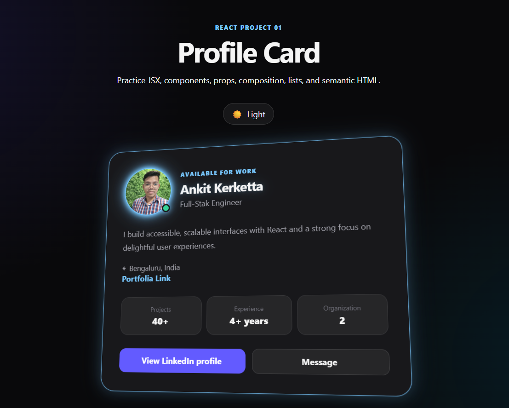
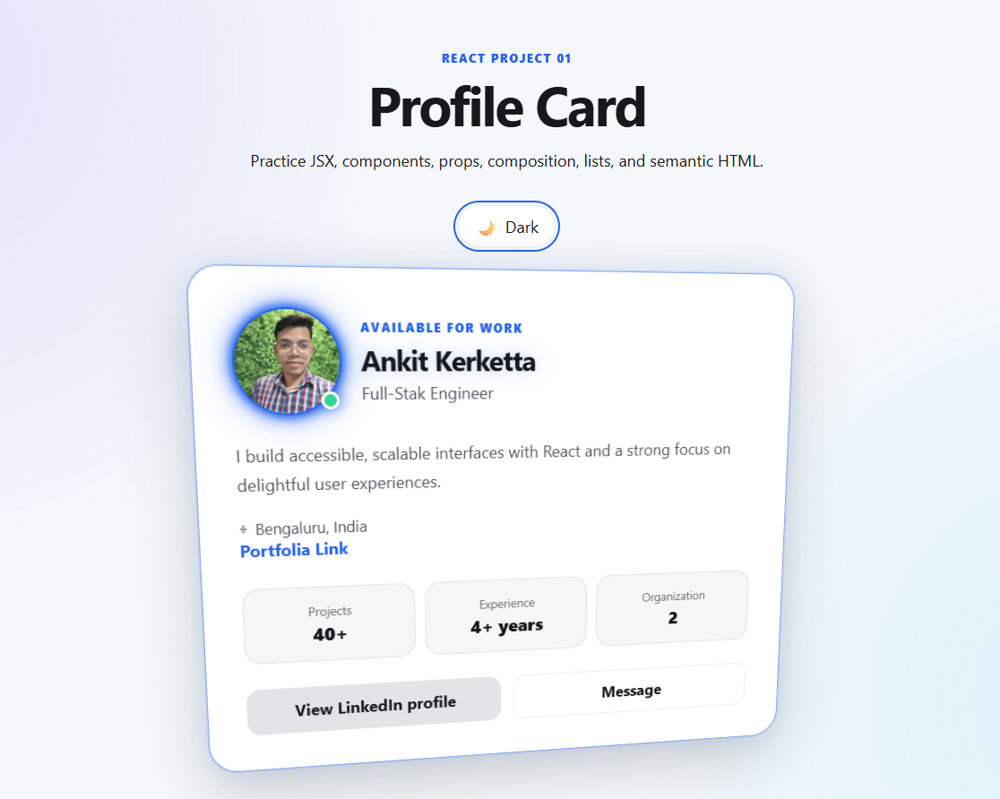

# Profile Card — React Learning Project 01





A small professional React app designed to practice the fundamentals through component-driven development.

## Concepts covered

- JSX
- Functional components
- Props
- Component composition
- Array rendering with `map()`
- Stable `key` props
- Destructuring
- Semantic HTML
- Accessibility basics
- Responsive CSS
- React Strict Mode

## Run locally

```bash
npm install
npm run dev
```

Then open the local URL shown by Vite.

## Build for production

```bash
npm run build
npm run preview
```